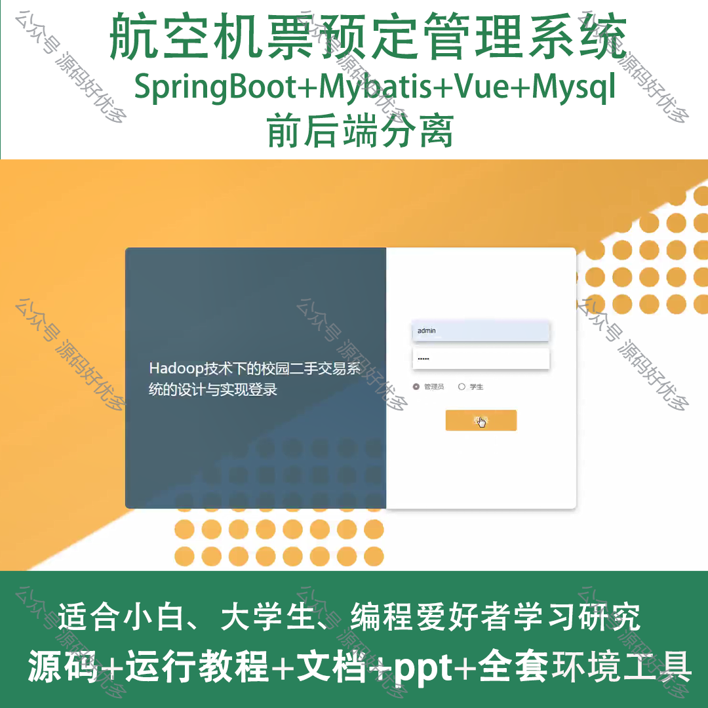
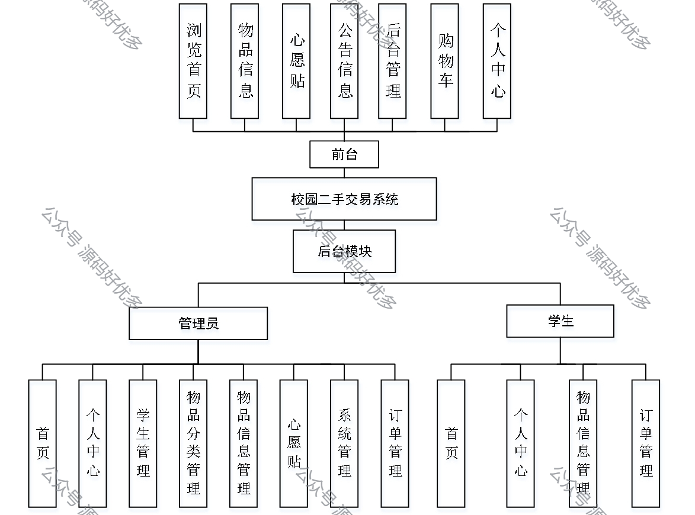
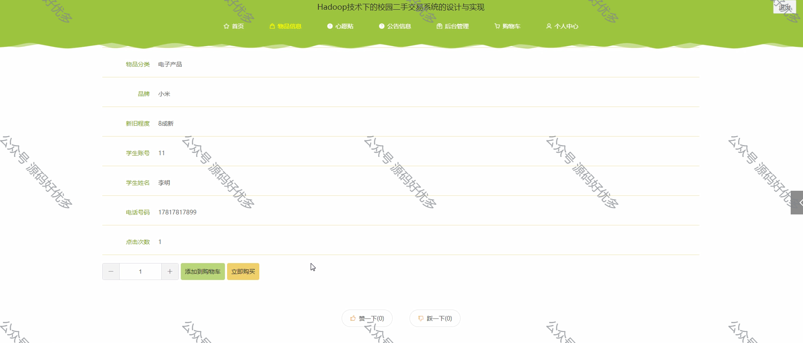
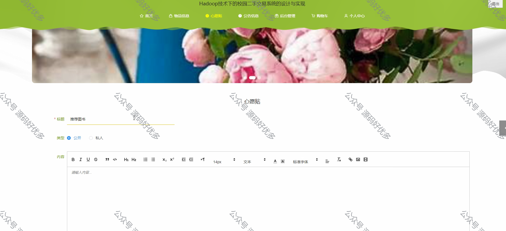
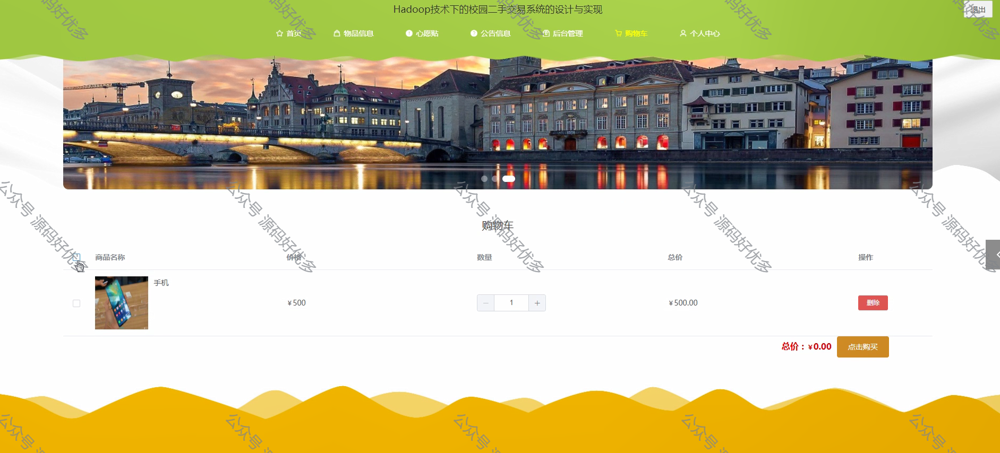
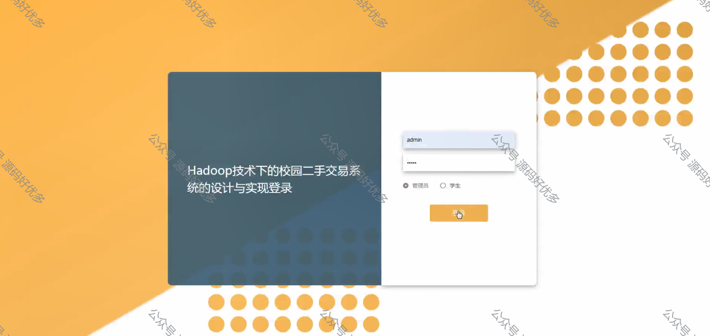
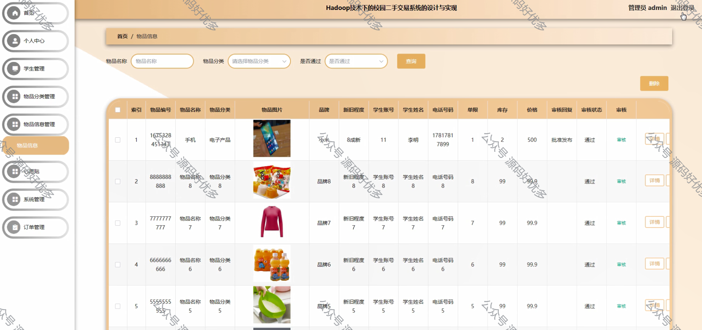
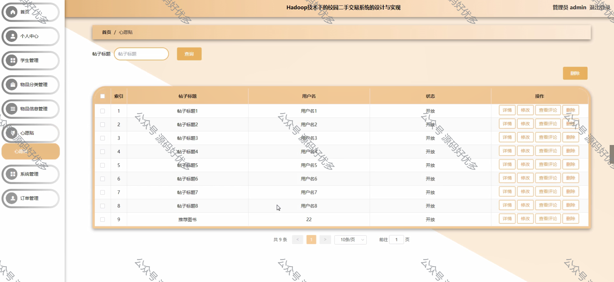
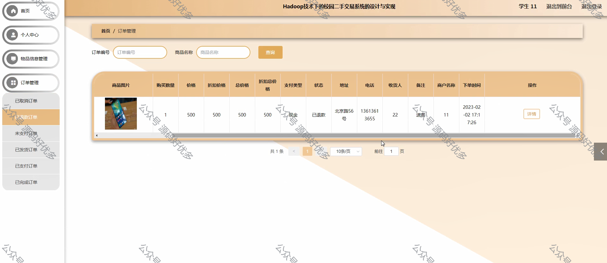
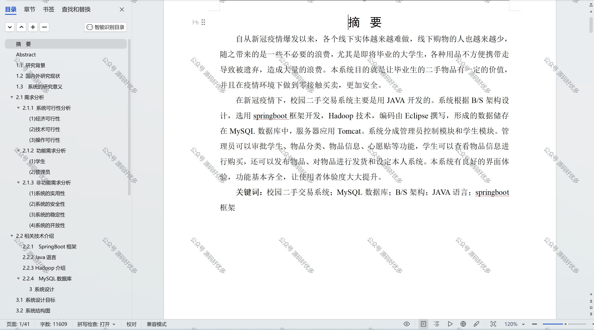

 
## 查看主页获取源码

> **作者介绍**： **✌**全网粉丝10W+本平台特邀作者、博客专家、CSDN新星计划导师、java领域优质创作者,博客之星、掘金/华为云/阿里云/InfoQ等平台优质作者、专注于项目实战 **✌**

  

### 一、作品包含

源码+数据库+设计文档万字+PPT+全套环境和工具资源+部署教程

### 二、项目技术

前端技术：Html、Css、Js、Vue、Element-ui

数据库：MySQL

后端技术：Java、Spring Boot、MyBatis

  

### 三、运行环境

开发工具：IDEA/eclipse

数据库：MySQL5.7

数据库管理工具：Navicat10以上版本

环境配置软件： JDK1.8+Maven3.6.3

前端Nodejs：14

### 四、项目介绍
项目编号：springbootA085

在新冠疫情下，校园二手交易系统主要是用JAVA开发的。系统根据B/S架构设计，选用springboot框架开发，Hadoop技术，形成的数据储存在MySQL数据库中，服务器应用Tomcat。系统分成管理员控制模块和学生模块。管理员可以审批学生、物品分类、物品信息、心愿贴等功能，学生可以查看物品信息进行购买，还可以发布物品、对物品进行发货和设定本人系统。本系统有良好的界面体验，功能基本齐全，让使用者体验度大大提升

### 五、运行截图

  
